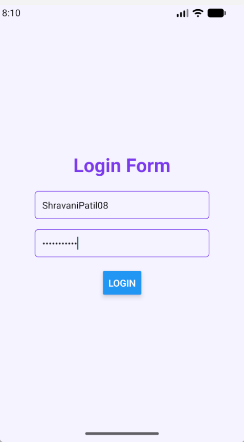
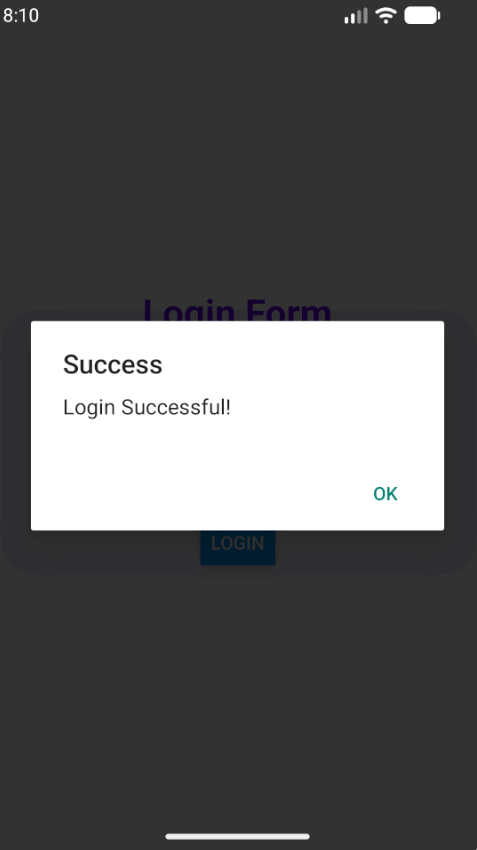
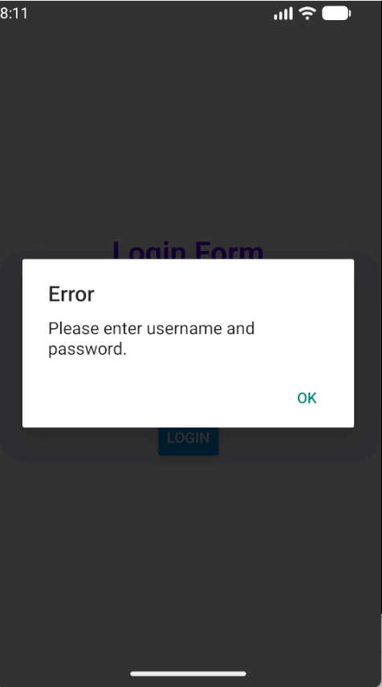
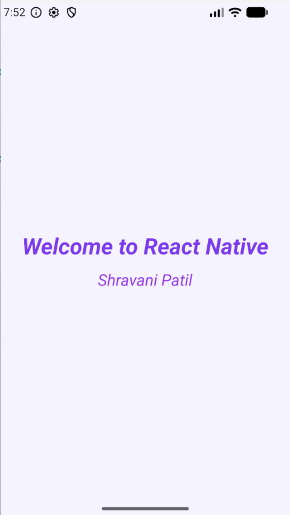
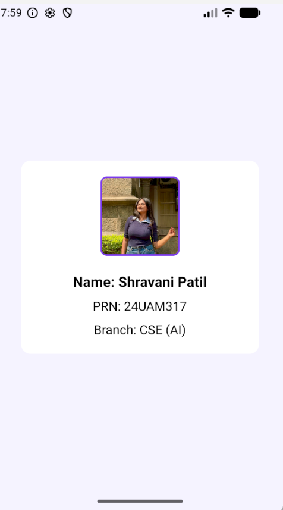
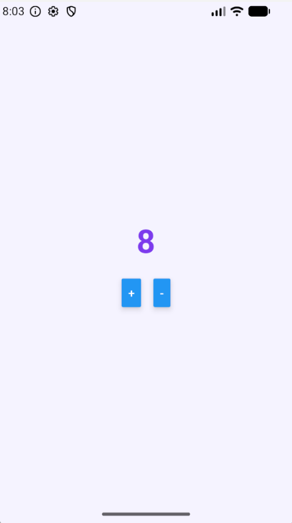

# React Native – Experiment 2

## 1. Welcome to react native with your name. 

<p align="center">
  
</p>

---

## 2. Login form using React Native.

<p align="center">

</p>

---

<p align="center">

</p>

---

<p align="center">

</p>

---

## 3. Command to Create a React Native Project

Use the following command to initialize a new React Native application.

```bash
npx @react-native-community/cli init MyApp
```

The command automatically creates the project directory, installs the necessary dependencies, and prepares the default project structure.

### Default Files Generated

- android
- ios
- node_modules
- package.json
- package-lock.json
- App.tsx
- index.js

---

## 4. Purpose of the `android` Folder

The **android** directory stores all Android-specific project files required for compiling and running the application on Android devices.

### Contents

- Gradle configuration
- AndroidManifest.xml
- Java/Kotlin source code
- Drawable and resource files

Whenever an APK is generated or the application is installed on an Android phone, these files are used during the build process.

---

## 5. Why is the `ios` Folder Included?

The **ios** directory contains the native iOS project created for Xcode. It allows the same React Native project to be compiled and executed on Apple devices.

### Folder Includes

- Xcode project
- Swift/Objective-C files
- Assets
- Configuration files

> This folder is mainly required while developing on macOS.

---

## 6. Which File Acts as the Main Screen?

The **App.tsx** file serves as the primary screen of a React Native application. All major UI components are generally designed inside this file.

### Responsibilities

- Display application UI.
- Organize layouts.
- Handle user interaction.
- Render child components.

---

## 7. Difference Between `package.json` and `package-lock.json`

| package.json | package-lock.json |
| :----------- | :---------------- |
| Defines project information and dependencies. | Stores the exact installed versions of dependencies. |
| Modified manually when required. | Automatically maintained by npm. |
| Used for dependency management. | Ensures consistent installations across systems. |

---

## 8. Purpose of the `node_modules` Folder

The **node_modules** folder stores every package installed through npm. These dependencies are necessary for building and executing the application.

### Why It used -

- Contains third-party libraries.
- Required during project execution.
- Automatically recreated using `npm install`.

---

## 9. Entry File of the Application

The application starts execution from **index.js**. It registers the root component and launches the React Native application.

### Functions

- Registers `App`.
- Starts the application.
- Connects JavaScript to the native environment.

---

## 10. Metro Bundler

**Metro Bundler** is the default bundling tool for React Native projects. It converts JavaScript source code into a bundle and updates the application whenever code changes are saved.

### Features

- Fast Refresh
- JavaScript bundling
- Asset management
- Automatic rebuilding

---

## 11. Command to Run the Android Application

```bash
npx react-native run-android
```

This command compiles the Android project, installs it on a connected device or emulator, and launches the application.

---

## 12. Checking Whether an Android Device is Connected

Execute the following command:

```bash
adb devices
```

### Sample Output

```bash
List of devices attached
NN9LQOBY8L8DKNDE  device
```

If the status shows **device**, the Android phone is properly connected and ready for debugging.

---

# Program Outputs

## Program 15 – Change Text Color.

<p align="center">

</p>

---

## Program 16 – Change Text Style.

<p align="center">

</p>

---

## Program 17 – Change Background Color.

<p align="center">

</p>

---

## Program 18 – Student Information Card.

<p align="center">

</p>

---

## Program 19 – Counter Application.

<p align="center">

</p>

---
