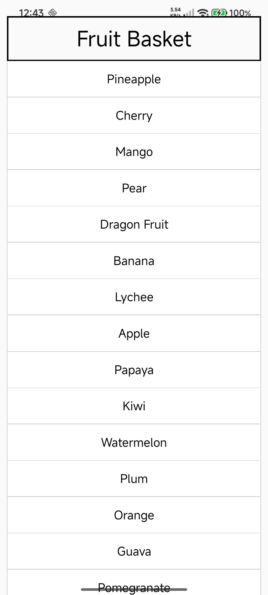

# React Native – Experiment 3

## 1. Check Flexbox Properties

**Flexbox** is used in React Native to arrange components inside a layout.

### Common Flexbox Properties

- `flexDirection` – Defines the direction of items.
- `justifyContent` – Aligns items along the main axis.
- `alignItems` – Aligns items along the cross axis.
- `flex` – Controls how much space a component occupies.
- `flexWrap` – Allows items to move to the next line.

### Example

```jsx
<View style={{
  flexDirection: 'row',
  justifyContent: 'space-between',
  alignItems: 'center'
}}>
```

---

## 2. Create Fruit List Using FlatList

**FlatList** is a React Native component used to display a list of data efficiently.

### Output

<p align='center'>

</p>

---

## 3. Create About Page Using ScrollView

**ScrollView** is used when the content is larger than the available screen space.

An About page can contain multiple paragraphs about the college.

### Output

<p align='center'>

</p>

<p align='center'>

</p>

---

## 4. Why Do We Use `<View>` Component?

**`<View>`** is a basic container component in React Native.

It is used to:

- Group multiple components.
- Create layouts.
- Apply styles.
- Arrange components using Flexbox.

### Example

```jsx
<View>
  <Text>Hello</Text>
  <Text>Welcome</Text>
</View>
```

---

## 5. Difference Between `<Text>` and `<View>`

| `<Text>` | `<View>` |
| :----- | :----- |
| Used to display text. | Used as a container. |
| Displays strings and text content. | Groups and arranges components. |
| Used for headings, labels, paragraphs, etc. | Used for layouts and sections. |

### Example

```jsx
<View>
  <Text>Hello React Native</Text>
</View>
```

---

## 6. What is a StyleSheet?

**StyleSheet** is a React Native API used to create and organize styles for components.

It is similar to CSS in web development.

### Example

```jsx
const styles = StyleSheet.create({
  container: {
    flex: 1,
    padding: 20,
  },
  title: {
    fontSize: 24,
    fontWeight: 'bold',
  },
});
```

---

## 7. Why Do We Use Flexbox?

**Flexbox** is used to create flexible and responsive layouts.

It helps developers:

- Arrange components easily.
- Align items.
- Distribute available space.
- Create layouts for different screen sizes.

---

## 8. Default Flex Direction

The default value of `flexDirection` in React Native is:

```jsx
column
```

This means components are arranged vertically from top to bottom by default.

---

## 9. Difference Between `justifyContent` and `alignItems`

| `justifyContent` | `alignItems` |
| :----- | :----- |
| Aligns items along the main axis. | Aligns items along the cross axis. |
| Depends on `flexDirection`. | Works perpendicular to the main axis. |
| Used for distributing space. | Used for cross-axis alignment. |

With the default `flexDirection: 'column'`:

- `justifyContent` → Vertical alignment.
- `alignItems` → Horizontal alignment.

---

## 10. What is `flex`?

**`flex`** controls how much available space a component occupies inside its parent.

### Example

```jsx
<View style={{ flex: 1 }}>
```

`flex: 1` generally means the component takes the available space of its parent.

---

## 11. When Do We Use ScrollView?

**ScrollView** is used when the content is larger than the screen and the user needs to scroll through it.

### Suitable For

- About pages.
- Long text.
- Forms.
- Static content.
- Pages with a small number of components.

---

## 12. When Do We Use FlatList?

**FlatList** is used to display lists containing multiple items.

It is especially useful for dynamic or large lists.

### Suitable For

- Fruit lists.
- Product lists.
- Contact lists.
- Messages.
- User lists.

---

## 13. Why is FlatList Faster?

**FlatList** is faster for large lists because it does not render all items at the same time.

It renders items as they are needed while scrolling, which helps reduce memory usage and improve performance.

### Benefits

- Reduces memory usage.
- Improves performance.
- Handles large lists efficiently.

---

## 14. What Makes a UI Responsive?

A UI is **responsive** when it adjusts properly to different screen sizes and orientations.

### Important Factors

- Flexbox layouts.
- Flexible dimensions.
- Proper spacing.
- Avoiding unnecessary fixed sizes.
- Using `flex`, `flexDirection`, `justifyContent`, and `alignItems`.

---

## 15. Why Avoid Inline Styles?

Inline styles can make code difficult to read and maintain when many styles are used.

### Inline Style

```jsx
<Text style={{ fontSize: 20, margin: 10 }}>
  Hello
</Text>
```

### StyleSheet

```jsx
const styles = StyleSheet.create({
  text: {
    fontSize: 20,
    margin: 10,
  },
});
```

Using `StyleSheet` makes styles:

- Easier to read.
- Easier to maintain.
- Reusable.
- Better organized.

---
